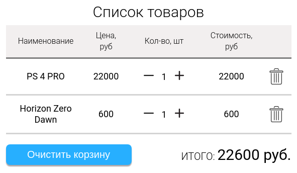
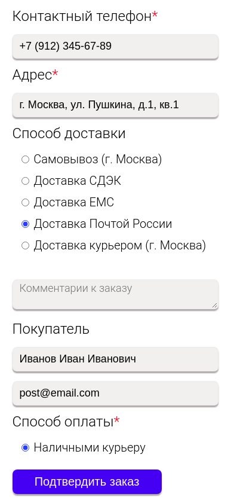
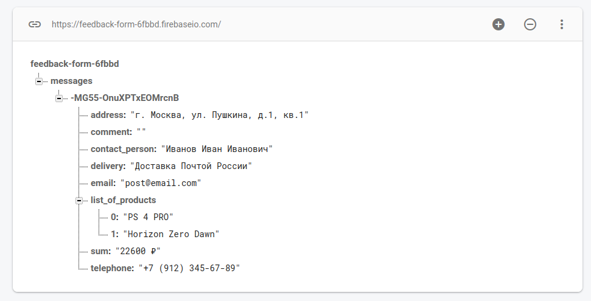
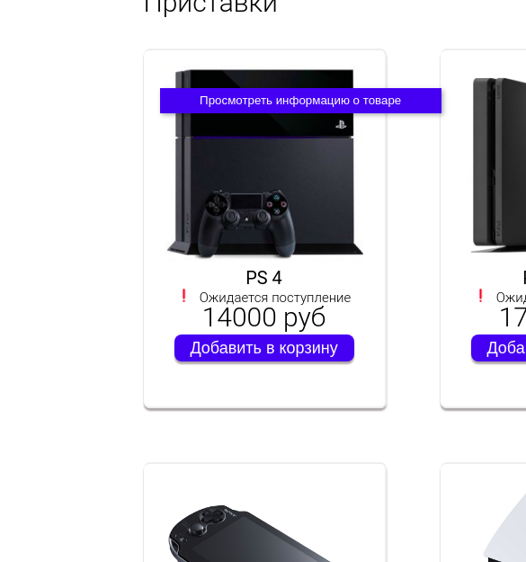
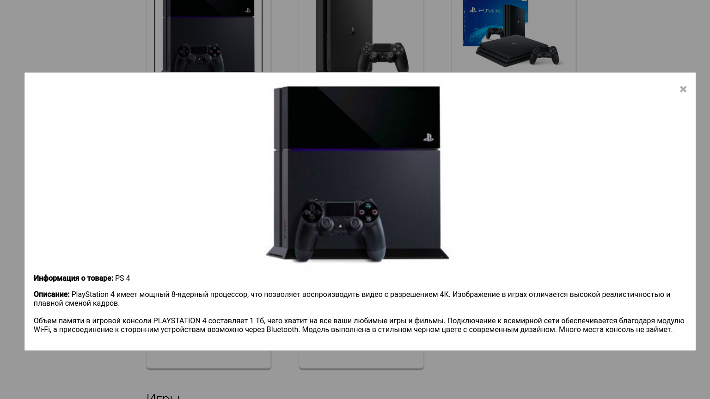
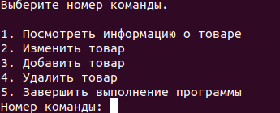

# Games Store - интернет-магазин игровых приставок, игр, аксессуаров

## Установка и развертывание web-приложения

1. Склонировать репозиторий и перейти в папку с сервером

    ```
    git clone https://github.com/bmstu-iu9/utp2020-2-shop.git
    cd utp2020-2-shop/src/server
    ```

2. Установить зависимости

    ```
    npm i chalk
    npm i nodemon -D
    npm i express --save
    npm i readline-sync -S
    npm i body-parser --save
    ```

3. Запустить приложение (Порт веб-сервера - 3000)

    ```
    node server
    ```

4. Для изменения файла с данными запустить скрипт

    ```
    node admin
    ```


## Участники

- Владислава Лумпова [@Sagnor](https://github.com/Sagnor)
- Ирина Тарасова [@izotarina](https://github.com/izotarina)
- Юлия Костюнина [@siiena25](https://github.com/siiena25)


## Функционал

#### Поиск по сайту

Для поиска по сайту необходимо ввести в поле "Поиск по сайту", расположенное на шапке страницы, название товара и  
выбрать его категорию из имеющихся (Playstation/ Nintendo Switch/ Xbox), затем нажать на кнопку поиска (Лупа).  
Если такой товар имеется, то он будет выведен на экран, иначе же пользователь получит сообщение "Ничего не найдено".

<p align="center">
  
</p>

#### Корзина 

На сайте присутствует специальный раздел "Корзина" с товарами, которые пользователь добавил для оформления заказа.  
Чтобы положить товар в корзину, нужно нажать на кнопку "Добавить в корзину" под любым товаром. На вкладке "Корзина"  
при добавлении товаров отображается текущее количество товаров в корзине. Внутри вкладки отображается таблица со   
столбцами (Наименование/ Цена, руб/	Кол-во, шт/	Стоимость, руб) и итоговая стоимость всей корзины под таблицей.   
Также, в самой вкладке можно как увеличивать, так и уменьшать количество уже выбранных товаров в корзине с помощью  
кнопок + и -, или же удалять товар с помощью кнопки в виде мусорной корзины. Присутствует возможность очистить всю  
корзину целиком с помощью кнопки "Очистить корзину" под таблицей. При отсутствии товаров в корзине отображается   
надпись "Ваша корзина пуста!".

<p align="center">
  
</p>

#### Форма отправки заказа

Данная форма находится в левой части раздела "Корзина". В форме присутствуют как обязательные поля для ввода   
(Контактный телефон, Адрес, Способ доставки, ФИО покупателя, Способ оплаты), так и необязательные (Комментарии  
к заказу, E-mail покупателя). При нажатии на кнопку "Подтвердить заказ" он отправляется в базу данных в реальном  
времени (Firebase).  

<p align="center">
  
  
</p>

#### Просмотр информации о товаре

Для того, чтобы посмотреть подробную информацию о товаре, нужно дважды кликнуть на его изображение.

<p align="center">
  
  
</p>

#### Изменение базы данных в консоли

Запустив скрипт, (выполнить команду "node admin" из папки ./src/server), администратор сайта может: посмотреть
информацию о товарах, выбрав компанию и категорию; изменить цену товара, количество на складе, изображение. 
Для сохранения изменений необходимо выполнить команду "Сохранить все изменения". Также можно отменить все 
несохраненные изменения соответствующей командой. В возможности администратора также входит добавление и 
удаление товаров. Управление осуществляется выбором номера команды.

<p align="center">
    
</p>    
